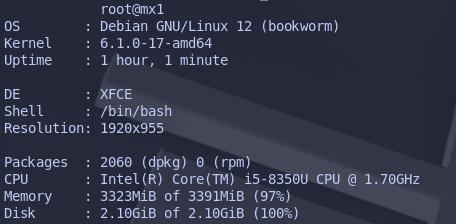

# Ufetch
System fetch tool for linux-based system, written in Rust

### Disclaimer
> This project is still <b>under development</b>. If you get any kind of problem, you are welcome to create an [issue!](https://github.com/avishekdutta531/Ufetch/issues)

### Special thanks to
* [neofetch](https://github.com/dylanaraps/neofetch)
* [sysfex](https://github.com/mehedirm6244/sysfex)
