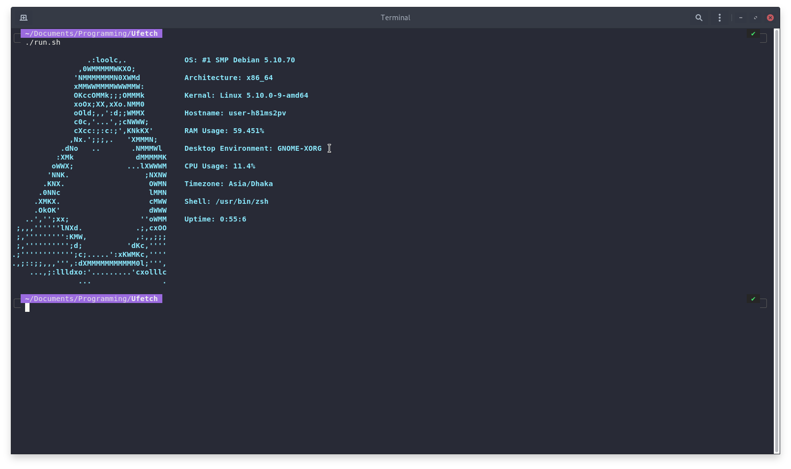

# Ufetch
A Modern Fetch Tool for Linux!

- [x] Programming Language: **Python**
- [x] IDE: **Visual Studio Code**
- [x] Developed by **Avishek Dutta**

> If you get any kind of problem, you are welcome to create an [issue!](https://github.com/avishekdutta531/Ufetch/issues)
